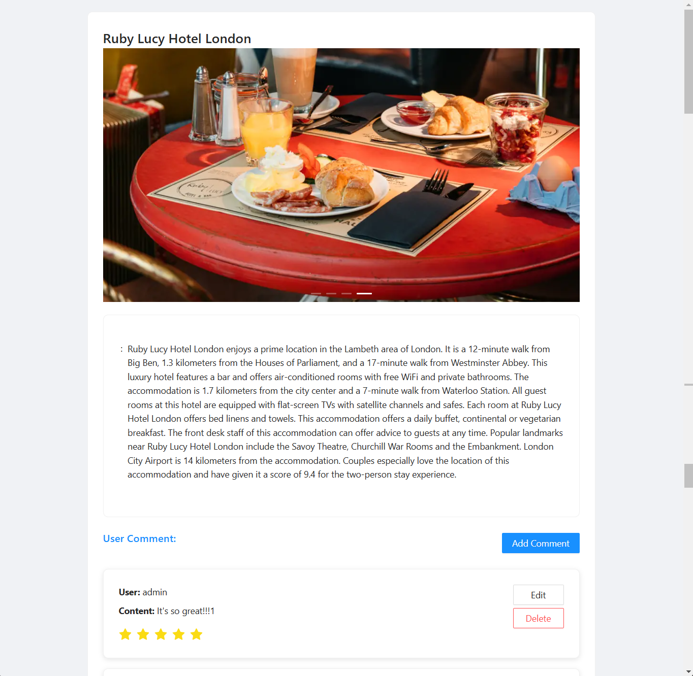
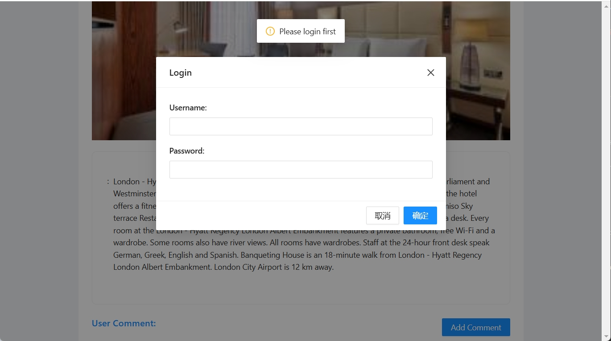
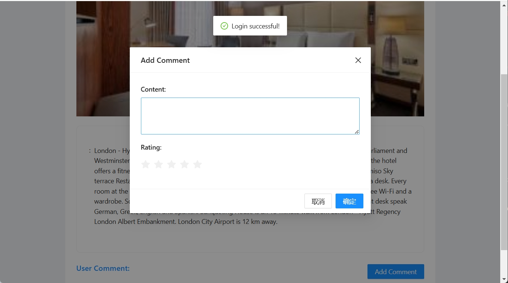

# Hotel Comment System

This is a hotel comment system built with Angular 19 (frontend), Flask (backend), MongoDB (database), and ng.ant.design (UI framework) that provides Create, Read, Update, and Delete (CRUD) functionalities.

## Screenshots

### Hotel List View


### Hotel Detail View


### Login View


### Review Management View


## Features

- **Create** new hotel reviews
- **Read** existing hotel reviews
- **Update** existing hotel reviews
- **Delete** inappropriate or outdated hotel reviews

## Technology Stack

- **Front-end**: Angular 19 + ng.ant.design
- **Back-end**: Python 3 + Flask

## Setup

### Backend

1. Install dependencies:

    ```bash
    pip install -r requirements.txt
    ```

2. Run the server:

    ```bash
    python run.py
    ```

### Frontend

1. Install dependencies:

    ```bash
    npm install
    ```

2. Start the development server:

    ```bash
    npm start
    ```

## Database

The system uses **MongoDB** as its database, which is initialized automatically on first run. 

### Database Collections

The system includes three main collections:

- `users`: Stores user information
  - Includes a default admin user (username: admin)
- `hotels`: Contains details about hotels
  - Pre-populated with sample London hotels
- `reviews`: Holds user reviews for hotels
  - Includes sample review data

### Auto-initialization

When the application starts for the first time:
1. The database collections are automatically created
2. Sample data is populated into the collections
3. A default admin user is created with:
   - Username: `admin`
   - Password: `adminpassword`

No additional database setup is required - the system is ready to use after starting the server.

